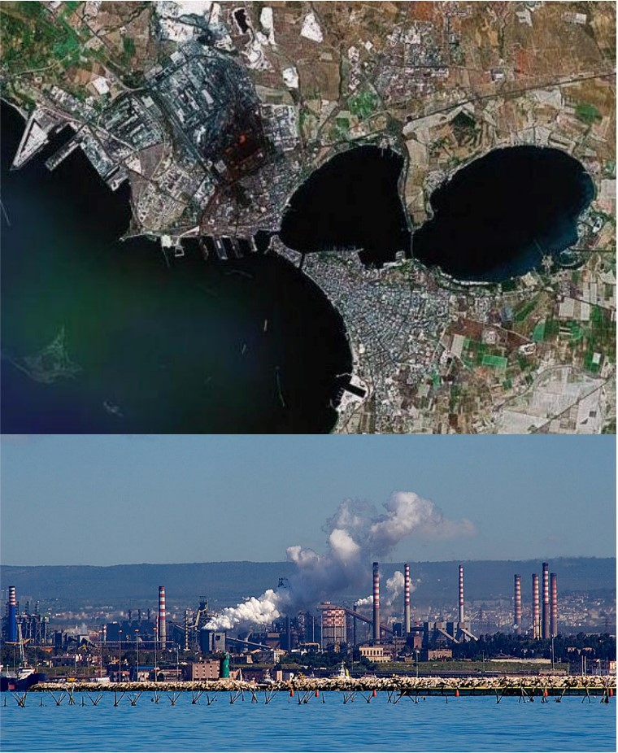

### Indice

1)Introduzione
1.1 Il particolato atmosferico 
1.2 Origine 
1.3 Effetti sulla salute umana 
1.4 Legislazione
1.5 Obiettivi della ricerca
2) Materiali e metodi
2.1 I dati
2.2 Analisi esplorativa
2.3 Analisi statistica
3) Risultati 
4) Conclusione
5) Bibliografia


shshsh

### 1) Introduzione


Negli ultimi decenni diversi studi di stampo epidemiologico e tossicologico hanno indicato  l’inquinamento atmosferico come responsabile di effetti avversi sulla salute dell’uomo e dell’ambiente, (APAT, 2007). Le evidenze scientifiche hanno documentato un’ampia gamma di esiti sanitari e ambientali negativi dovuti alla presenza di particolato atmosferico (Particulate matter, PM) nell’aria.  La presenza di particolato atmosferico nell’aria è infatti considerata la causa di irritazioni dell’apparato respiratorio fino al tumore al polmone, e la concausa dei cambiamenti climatici (Quarol et al., 2001).

##1.1 Il particolato atmosferico 
Le particelle costituenti il PM variano per composizione, origine e dimensione, (APAT, 2007). Il particolato atmosferico è una miscela complessa di particelle (carbonio, ammonio, nitrati, solfiti, polveri minerali, elementi in traccia e acqua), (Hueglin et al., 2005), le cui sostanze possono presentarsi miscelate allo stato condensato (solido o liquido).  
Il particolato atmosferico viene notoriamente classificato in base al diametro aerodinamico delle particelle che lo costituiscono, poiché da questa caratteristica dipende il tempo di sospensione e quindi la permanenza nell’aria, (APAT, 2007): 

•	PM10 : particelle di diametro aereodinamico inferiore ai 10 micron, raggiungono la parte sommitale del sistema respiratorio e, parzialmente, i polmoni. Le precipitazioni rimuovono queste particelle dall’aria dopo poche ore dalla loro emissione. 
•	PM2.5: particelle di diametro aereodinamico inferiore ai 2.5 micron, sono le più pericolose poiché penetrano a fondo nei polmoni e vi permangono. Le precipitazioni non rimuovono considerevolmente dall’aria queste particelle, così che esse possono permanere in atmosfera per giorni o addirittura settimane dopo la loro emissione. 

##1.2 Origini del particolato atmosferico
Le origini del particolato atmosferico sono varie e se ne riconoscono di antropogeniche e di naturali. Tra i processi antropici che emettono particolato atmosferico nell’aria ricordiamo: la combustione di carburante per veicoli (sia diesel che benzina), i combustibili solidi (carbone, lignite e biomassa), il riscaldamento domestico, le attività industriali (come costruzioni, miniere, manifattura di cemento, ceramica e mattoni, fusione), l’erosione del manto stradale a causa del traffico, le abrasioni di freni e pneumatici, i lavori in grotte e miniere (APAT, 2007). 

##1.3 Effetti sulla salute umana 
Gli effetti dell’inquinamento atmosferico da PM10 sulla salute umana sono stati oggetto di intensi studi negli ultimi anni, (Hueglin et al., 2005). L'esposizione a particolato atmosferico (PM10) è stata associata ad aumenti della mortalità e dei ricoveri ospedalieri dovuti a malattie respiratorie e cardiovascolari. Gli effetti sono stati osservati per esposizioni a livelli molto bassi di concentrazione di PM10  e non è chiaro se esista una concentrazione soglia per il particolato al di sotto della quale non sono probabili effetti sulla salute. Studi in vitro ed in vivo su animali ed esseri umani hanno rivelato potenti effetti pro – infiammatori  che coinvolgono cellule epiteliali polmonari. Il particolato atmosferico una volta nel polmone viene assorbito dalle cellule epiteliali ed attaccato dai macrofagi. L’attacco dei macrofagi alveolari instaura la secrezione da parte delle cellule del polmone di citochinine e mediatori immunitari nel sangue che stimolano l’attivazione dei globuli bianchi (neutrofili e  linfociti), (Brunekreef e Holgate, 2002). Nel breve periodo l’infiammazione porta ad un danno tissutale acuto conosciuto come metaplasia polmonare (Terzano, 2006), rilevabile per la presenza di proteine come il recettore del fattore di crescita epidermico (EGFR) che evidenziano tentativi di riparazione dell'organo, e produzione continua di muco che porta ad un restringimento del lume polmonare. Attraverso l'attivazione delle vie di segnalazione dello stress dall'epitelio ai microvasi polmonari, vengono generati fattori che influenzano la coagulazione del sangue il che può condurre a disturbi circolatori come l’aritmia, (Brunekreef e Holgate, 2002). Nel ’98 l’OMS ha indicato le elevate concentrazioni di PM10 in otto città italiane (media pesata 52.6 g/m3), come causa di 3500 decessi, (APAT, 2007). 

##1.4 Legislazione
	In numerosi Paesi, le concentrazioni del particolato atmosferico di entrambe le categorie dimensionali vengono misurate regolarmente da decenni. In Italia, con poche eccezioni (Firenze, ad esempio), solo il PM10 è misurato routinariamente in centraline fisse di monitoraggio, poiché esso è considerato una buona misura del complesso mix di inquinanti solidi e gassosi creati dal trasporto, dalla combustione di carburanti per veicoli e dalla produzione di energia elettrica e termica, (APAT, 2007; Gasparinetti, 2015). 
	Alla luce delle conseguenze sanitarie dovute a concentrazioni superiori alla concentrazione considerata naturale per il PM10 (6 g/m3), su indicazione dell’Organizzazione mondiale della sanità (OMS), il Consiglio Europeo ha emanato la Direttiva 1999/30/EC (Unione Europea, 1999) nella quale vengono introdotti due differenti limiti per il PM10 per la protezione della salute umana: un limite per la media giornaliera di 50 μg/m3, da non superarsi per più di sette volte in un anno, e uno per quella annuale, 40 g/m3, (Lena e Pirrollo, 2010). Questi limiti sono stati successivamente confermati nella Direttiva 2008/50/CE (Gazzetta Ufficiale dell’Unione Europea, 2008) 

## 1.5 Obiettivi della ricerca. 

Numerosi studi hanno indagato il potenziale ruolo dei fattori meteorologici, nella diminuzione della concentrazione del particolato atmosferico in alcune città e zone rurali europee  (i.e: Sanchez – Reina et al., 2006; Olszowsky, 2015;), con esiti positivi: la concentrazione di particolato atmosferico con diametro aereodinamico 10 g (PM10) viene influenzata dalla presenza di precipitazioni atmosferiche e varia a seconda della direzione del vento. Nella presente ricerca viene esaminata la concentrazione di PM10 in una delle città più inquinate d’Italia, Taranto. 
Gli obiettivi della seguente ricerca sono....
è indagare cosa regola la conc di pm10


#2)Materiali e metodi

## 2.1) I dati

Sono stati analizzati i valori giornalieri (espressi in media giornaliera) di concentrazione della polevere sottile PM10. Il data frame è composto da 365 osservazioni su di 11 variabili.
Le variabili sono:Media(valore medio giornaliero), Mediana (valore mediano giornaliero), Massima (valore massimo giornaliero), Temperatura, Umidità relativa, Pioggia, Radiazione solare, Pressione, Velocità del vento, Direzione del vento (secondo la rosa dei venti), Data.

#2.2)Analisi esplorativa

Per comprendere il comportamento dei dati è stata condotta un'analisi esplorativa dei dati. Inizialmente disegnando dei Boxplot, per evidenziare la presenza di possibili valori anomali (outliers),disegnando dei grafici a dispersione a coppie e gli istogrammi delle stesse, infine attraverso l'analisi delle componenti principali(ACP o PCA,Principal component analysis) si è tentato di  rappresentare l'insieme dei dati in uno spazio di dimensione ridotta. 

```{r}
#setto la WD ----
pm10 <- read.csv2("data/pm2010.csv", dec = ".")

#questo è un pacchetto di pacchetti. Contiene molti pacchetti utili :-)

library(tidyr)
#creO variabile per anno, giorno, mese
pm10_a <- separate(pm10, col = "data", into = c("anno","mese","giorno"), sep = "-")

pm10_a$mese2 <- as.numeric(pm10_a$mese)

str(pm10_a)        

pm10_a$mese2


pm10_a$giorno2 <- as.numeric(pm10_a$giorno)
str(pm10_a)
# stagioni: primavera (21-03 / 20-06), estate (21-06/22-09), autunno (23-09 /21-12)
# inverno(22-12/20-03)

#divido in stagioni ----
getSeason <- function(DATES) {
  WS <- as.Date("2010-12-22", format = "%Y-%m-%d") # Winter Solstice
  SE <- as.Date("2010-3-21",  format = "%Y-%m-%d") # Spring Equinox
  SS <- as.Date("2010-6-21",  format = "%Y-%m-%d") # Summer Solstice
  FE <- as.Date("2010-9-23",  format = "%Y-%m-%d") # Fall Equinox
  d <- as.Date(strftime(DATES, format="2010-%m-%d"))
  
  ifelse (d >= WS | d < SE, "Winter",
          ifelse (d >= SE & d < SS, "Spring",
                  ifelse (d >= SS & d < FE, "Summer", "Fall")))
}


k <- getSeason(pm10$data)


pm10_a$Stagione<- k

table(pm10_a$Stagione)


summary(pm10_a)
```
```{r}

data_hills<-(pm10_a[1:10])
data_hills$stagione<-pm10_a$Stagione


```


```{r}
#un modo carino per selezionare i colori
color = grDevices::colors()[grep('gr(a|e)y', grDevices::colors(), invert = T)]

# questo comando crea un oggetto che si chiama color che contiene tutti e 433 i colori base di R escluse le scale di grigio
# poi basta fare col = sample(color, n) all'intero di una funzione che usa come argument col
# dove n è il numero di colori che devi utilizzare

#alternativa se 433 colori sono troppi
library(RColorBrewer)
qual_col_pals = brewer.pal.info[brewer.pal.info$category == 'qual',]
col_vector = unlist(mapply(brewer.pal, qual_col_pals$maxcolors, rownames(qual_col_pals)))
# questa funzione produce un vettore di 74 colori
```

# plot


```{r}
library(ggplot2)
pm10$data2 <- seq(1,365,1)


ggplot(pm10, aes(x = data2)) +
  geom_path(aes(y = media), color = "red") +
  geom_path(aes(y = mediana), color = "blue") +
  geom_path(aes(y = max), color = "green")
  

```


#boxplot
```{r}

boxplot(data_hills$media~data_hills$stagione,col=col_vector,main="Concentrazioni medie di Pm10")

boxplot(data_hills$max~data_hills$stagione,col=col_vector, main="Concentrazioni massime di Pm10 ")

plot(data_hills$dv,data_hills$media, main=" Boxplot concentazione Pm10 e direzione del vento",ylab="Concentrazione media di Pm10", col=col_vector)

boxplot(pm10_a$media~pm10_a$mese2,col=col_vector,main="Concentrazioni medie di Pm10 per mese")

```


Dall'osservazione dei Boxplot sulla concentrazione media di Pm10 in relazione alla direzione del vento (secondo la rosa dei venti),il vento da SudEst presenta dei valori anomali, e quindi concetrazioni di Pm10 più alte rispetto alle altre direzioni.
Ulteriori boxplot relativi alle concentrazioni medie e massime di Pm10 in relazione alle stagioni,sono stati disegnati  per verificare se vi fosse presenza di valori anomali o variazioni evidenti in una determinata stagione rispetto alle altre. Dal boxplot delle stagioni e maggiormente del mese è risultato un andamento sinusoidale che indica stagionalità.


# Grafico a gruppi

```{r}
panel.hist <- function(x, ...)
{
  usr <- par("usr"); on.exit(par(usr))
  par(usr = c(usr[1:2], 0, 1.5) )
  h <- hist(x, plot = FALSE)
  breaks <- h$breaks; nB <- length(breaks)
  y <- h$counts; y <- y/max(y)
  rect(breaks[-nB], 0, breaks[-1], y, col = "cyan", ...)
}


panel.cor <- function(x, y, digits = 2, prefix = "", cex.cor, ...)
{
  usr <- par("usr"); on.exit(par(usr))
  par(usr = c(0, 1, 0, 1))
  r <- abs(cor(x, y))
  txt <- format(c(r, 0.123456789), digits = digits)[1]
  txt <- paste0(prefix, txt)
  if(missing(cex.cor)) cex.cor <- 0.8/strwidth(txt)
  text(0.5, 0.5, txt, cex = cex.cor * r)
}
```

```{r}
data_pca <- pm10_a[,c(1:9)]
pairs(data_pca,upper.panel =panel.smooth,lower.panel=panel.cor,diag.panel = panel.hist)
```

# PCA
```{r}
### PCA ANALYSIS ----
require(ade4)

names(pm10_a)

#estraggo da pm10 solo le variabili numeriche da inserire nella PCA escludendo giorno mese e anno che sono da considerarsi factors
data_pca <- pm10_a[,c(1:9)]

# con nf = 3 gli stò dicendo di tenere tre assi
pcapm <- dudi.pca(data_pca, scannf = FALSE, nf = 3)

#faccio il biplot, cos'è clab.row?
# clab.row serve a gestire la grandezza dei quadratini delle osservazioni
# clab.col invece controlla le variabili
scatter(pcapm, clab.row = 0.5)

#valori dei punteggi per le variabili
pcapm$c1
```


Nell'analisi in componenti principali si è preferito tenere in considerazione le sole variabili quantitative, per poter visualizzare in maniera chiara la distribuzione dell'informazione presente nel dataset tenendo 3 assi.Attraverso la somma cumulata degli autovalori, è stato possibile calcolare la percentuale di informazione spiegata dalle componenti.Le 3 componenti principali spiegano il 71% dell' informazione presente nel dataset.
Gli autovalori corrispondono alla quantità di variabilità spiegata lungo l' autovettore, il primo autovettore rappresenta le concentrazioni medie di Pm10, le concentrazioni massime di Pm10 e la Mediana, che risultano essere abbastanza correlate(media e mediana maggiormente con una correlazione di 0.97, mentre media e max un valore di 0.81).
La seconda compontente rappresenta le variabili ambientali: temperatura, pressione e radiazione solare hanno correlazione negativa rispetto all'umidità. La pioggia sembra essere al litime, con un autovalore abbastanza basso. La terza componente rappresenta il vento.

```{r}
#cerchio di correlazione, i punteggi delle varibili sono plottati su una circonferenza di raggio unitario
par(mfrow = c(2,2))
s.corcircle(pcapm$c1, xax = 1, yax = 2) #plotto prima e seconda
s.corcircle(pcapm$c1, xax = 1, yax = 3) #plotto prima e terza
s.corcircle(pcapm$c1, xax = 2, yax = 3) #plotto seconda e terza
```

# **Autovalori**

```{r}
#calcolo gli autovalori
pcapm$eig / sum(pcapm$eig) 

#calcolo la somma cumilata degli autovalori
cumsum(pcapm$eig / sum(pcapm$eig)) # con i primi tre assi spiego circa il 70% che non è male
```


## Le variabili qualitative

```{r}

par(mfrow= c(1,1))
s.class(pcapm$li, factor(pm10_a$Stagione), xax = 1, yax = 2, col = c(1,2,3,4)) 
s.class(pcapm$li, factor(pm10_a$Stagione), xax = 1, yax = 3, col = c(1,2,3,4))
s.class(pcapm$li, factor(pm10_a$Stagione), xax = 2, yax = 3, col = c(1,2,3,4))


s.class(pcapm$li, factor(pm10_a$Stagione), xax = 2, yax = 3, col = rainbow(4)) #se volessi usare la funzione rainbow


```

Primo piano fattoriale comp 1-2: le ellissi si dispongono trasversalmente. Tuttavia cosa si nota,sembrerebbe esserci una maggiore variazione sulla direzione della seconda componente rispetto alla prima. Il che significa che c'è una certa variazione dei fattori ambientali durante l'anno (come ci aspettiamo), temperatura , radiazione solare e pressione elevate in estate e invece umidità e forse precipitazioni (ha punteggio basso) elevate in inverno. 
- in termini di concentrazione di pm10 c'è una variazione ma sembrerebbe essere inferiore rispetto a quelle delle variabili ambientali. Tuttavia, l'asse maggiore delle ellissi per autunno e inverno è lungo la direzione della prima componente il che indica che in quei mesi c'è una maggiore varibilità ma in termini di media stagionale sono identici.
- La primavera è praticamente un cerchio il cui centro combacia con il centro del piano fattoriale indicando che le condizioni corrispondono alla media del sistema. 
il fattore stagionale in termini di conc di pm10 e fattori ambientali è piuttosto evidente.
```{r}
#DIREZIONE DEL VENTO ----
s.class(pcapm$li, factor(pm10_a$dv), xax = 1, yax = 2, col = sample(col_vector, nlevels(pm10$dv)))
s.class(pcapm$li, factor(pm10_a$dv), xax = 1, yax = 3, col = sample(col_vector, nlevels(pm10$dv)))
s.class(pcapm$li, factor(pm10_a$dv), xax = 2, yax = 3, col = sample(col_vector, nlevels(pm10$dv)))

s.class(pcapm$li, factor(pm10_a$dv), xax = 1, yax = 2, col = rainbow(nlevels(pm10$dv)),clabel = .8)

s.class(pcapm$li, factor(pm10_a$dv), xax = 1, yax = 3, col = rainbow(nlevels(pm10$dv)))
s.class(pcapm$li, factor(pm10_a$dv), xax = 2, yax = 3, col = rainbow(nlevels(pm10$dv)))

```

Per quanto rigarda il vento sembrerebbe essere maggiore solo in inverno il che corrisponde ad una conc più bassa di pm10 (come ci aspettiamo perchè il vento sparge i pm10 mentre la pioggia li fa depositare a terra)


- i venti da SE hanno una variabilità estrema in termini di pm10 e fattori ambientali 
- i venti da NW sono i più intensi ma non sembrano corrispondere ad una riduzione di conc di pm10.


# 2.3) Analisi statistica 

## La REGRESSIONE MULTIPLA

```{r}
mod2<-lm(media~tmp+max+vv+dv+rdz+pgg+umr+prs+stagione,data=data_hills)
summary(mod2)

```


Anche qui non puoi usare media, mediana e max insieme. Vendono chiaramente significative e ti alzano l'R^2 producendo un overfit
L'autunno non è sparito ma è finito nell'intercetta come "corner point". Se inserisci una variabile "Dummy" (Qualitativa) in un modello R sceglie automaticamente i primo livello in ordine alpha numerico come corner point. Vuol dire che stai confrontando la variazione dei pm10 in autunno rispetto alle altre variabili e stagioni. L'AIC è un criterio di verosimiglianza che serve a confrontare modelli tra loro. Non importa se sia alto o basso, quello dipende dalla quantità di variabilità presente nel modello. Tu devi "teoricamente" ricercare il modello che abbia l'AIC più basso possibile ma sempre confrontandolo con gli altri modelli che hai fatto. E' esattamente ciò che fa la stepwise.

```{r}
mod2<-lm(media~tmp+max+vv+dv+rdz+pgg+umr+prs+stagione,data=data_hills)
summary(mod2)
plot(mod2$residuals)

mod2s=step(mod2,direction="both")
summary(mod2s)
plot(mod2s$residuals)


qqnorm(mod2s$residuals)


plot(mod2s$residuals~data_hills$dv)
data_hills$stagione <- factor(data_hills$stagione)
plot(mod2s$residuals~data_hills$stagione)
acf(mod2s$residuals)
cor(data_hills[,c(1:9)])


```


```{r}


# medie e norma di legge ----

data_hills$normaL<-ifelse(data_hills$media<50.000,"low","high")

data_hills$normaL<-as.factor(data_hills$normaL)

plot(data_hills$media~data_hills$normaL)


# vorrei fare la stessa cosa che hai fatto qui con la norma di 
# legge.... però non ci riesco 

pm10$data2 <- seq(1,365,1)


ggplot(pm10, aes(x = data2)) +
  geom_path(aes(y = media), color = "red") +
  geom_path(aes(y = mediana), color = "blue") +
  geom_path(aes(y = max), color = "green")


```


# GAM

```{r}
library(mgcv)

require(mgcv)
data_hills<-(pm10_a[1:10])
data_hills$stagione<-pm10_a$Stagione
names(data_hills)
summary(data_hills)

hist(log(data_hills$pgg+1))
data_hills$l.pgg <- log(data_hills$pgg + 1)

data_hills$day <- seq(1,365,1)

g<-gam(media ~ max + s(day) + s(umr) + s(tmp) + s(pgg) + s(rdz) + s(vv) + s(prs) + dv, data=data_hills) # meglio questo
g1<-gam(media ~ max + umr + s(tmp) + s(l.pgg) + s(rdz) + vv + s(prs) + stagione + dv, data=data_hills)
summary(g); summary(g1)
plot(g)
acf(g$residuals)

gam.check(g)
g2<-predict(g,se=TRUE, type = "response")

plotdata <- plot(g, pages = 1)
str(plotdata)

# Convert it in a dataframe
dati_plot <- data.frame(day = plotdata[[1]]$x, fit = plotdata[[1]]$fit,
                        se= plotdata[[1]]$se)

plot(dati_plot$day, dati_plot$fit)

dati_plot$day <- as.integer(dati_plot$day)

# Calculate the CI
dati_plot$upr <- dati_plot$fit + (1.96 * dati_plot$se)
dati_plot$lwr <- dati_plot$fit - (1.96 * dati_plot$se)

data_hills2 <- merge(dati_plot, data_hills, by = "day", all.y = TRUE)

ggplot(data_hills2, aes(x = day, y = fit)) +
  geom_hline(aes(yintercept = 0), linetype = 6, color = "red") +
  geom_smooth(aes(ymin = lwr, ymax = upr), fill = "gray80", color = "black", size = 1, stat = "identity")

data_hills2$fit2 <- g2$fit
data_hills2$se2 <- g2$se.fit

data_hills2$upr2 <- data_hills2$fit2 + (1.96 * data_hills2$se2)
data_hills2$lwr2 <- data_hills2$fit2 - (1.96 * data_hills2$se2)


ggplot(data_hills2, aes(x = day)) +
  geom_point(aes(y = fit2), color = "black") + 
  geom_line(aes(y = fit2), color = "black", linetype = "twodash") + 
  geom_point(aes(y = media), color = "red") +
  geom_line(aes(y = media), color = "red", linetype = "solid") +
  geom_errorbar(aes(ymin = lwr2, ymax = upr2), width = .2, color = "grey40")


# QUESTO SOPRA è QUELLO VERO GLI ALTRI SOTTO PER CAZZARARE
data_media<-data_pca[,-2]
data_scaled<-scale(data_media)

data_scaled<-as.data.frame(data_scaled)
modscale<-lm(media~tmp+max+vv+rdz+pgg+umr+prs,data=data_scaled)
plot(modscale)
summary(modscale)
AIC(modscale)

a<-gam(max~s(pgg,by=vv),data=data_media)
plot(a,pages=1)
summary(a)


b<-gam(max ~ s(tmp,by=vv),data=data_media)
plot(b,pages=1)
summary(b)


c<-gam(media~ s(tmp,by=rdz),data=data_media)
plot(c,page=1)
summary(c)


d<-gam(media~s(tmp,by=vv),data=data_scaled)
plot(d,page=1)
summary(d)


e<-gam(media~s(umr,by=pgg),data=data_scaled)
plot(e,page=1)
summary(e)


data_hills$stagione <- factor(data_hills$stagione)
f<-gam(media~s(umr, by = stagione),data=data_hills)
summary(f)
plot(f)


```


# PIOGGIA


```{r}
boxplot(data_pca$pgg)
plot(data_pca$pgg,type="l")
pgg_l<-data_hills$pgg_l<-log(data_pca$pgg-1)


str(pgg_l)


plot(data_hills$max,data_hills$pgg,type="l")
plot(data_hills$max,data_hills$pgg_l,type="l")

```


